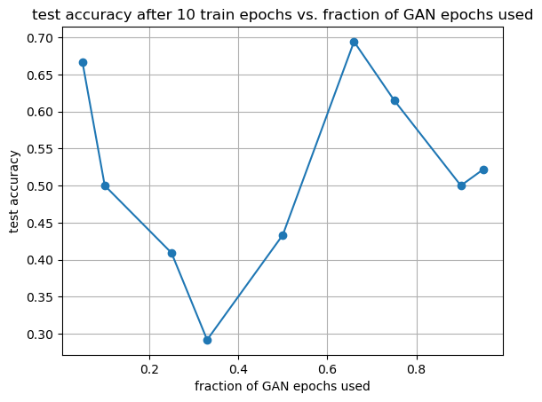

# EEGNet Classifier Jupyter Notebook (NREIP 2023)

- Goal: to produce a working implementation of the EEGNet classifier model (developed by Lawhern et al., ported to PyTorch by Sriram Ravindran) that can be customized to take input EEG data of various shapes.
    - [https://arxiv.org/abs/1611.08024](https://arxiv.org/abs/1611.08024)
    - [https://github.com/aliasvishnu/EEGNet/blob/master/EEGNet-PyTorch.ipynb](https://github.com/aliasvishnu/EEGNet/blob/master/EEGNet-PyTorch.ipynb)
- Note on data availability:
    - Tests were ran on a preprocessed version of the publicly available MBT42 dataset. The original files can be found here: [https://www.frontiersin.org/articles/10.3389/fnhum.2019.00128/full](https://www.frontiersin.org/articles/10.3389/fnhum.2019.00128/full)
    - The Jupyter Notebook files included in this repository:
        - PyTorch+EEGNET+MBT42.ipynb - shows the model running on the full MBT42 dataset.
        - 2chan_torch_eegnet_concat.ipynb - code for the informative ve. non-informative channel assessment.
        - synth_torch_eegnet.ipynb - code for running the GAN data with the model
        - synth_torch_eegnet_augment - the test accuracy scores vs. fractions of GAN data used.

- Building the classifier
    - [https://towardsdatascience.com/convolutional-neural-networks-for-eeg-brain-computer-interfaces-9ee9f3dd2b81](https://towardsdatascience.com/convolutional-neural-networks-for-eeg-brain-computer-interfaces-9ee9f3dd2b81) shows the inner workings of a different implementation of EEGNet, capable of non-binary classification
    - EEGNet operates using 3 convolution layers, then a fully connected layer.
        1. kernel size (1, C)
        2. kernel size of (2, 32)
        3. kernel size (8, 4)
        4. Fully connected layer, linear flattened to a shape of (reshape value, 1)
- Downloading code and setting up the EEGNet core
    - Libraries installed:
        - MNE - loading and processing of EEG data
        - PyTorch - ML/NN framework
        - numpy for managing and computing arrays
        - scikit-learn - used to create a pipeline, to create train/test/validate splits, return accuracy values, and to create a confusion matrix
        - matplotlib - plots
    - Challenges
        - The EEGNet-PyTorch repository provided an excellent starting point for my implementation. Challenges arose in attempting to fit the model to our dataset.
            - Firstly, I had to understand the input data structure. The MBT42 EEG data had to be shaped into a numpy array based on the design of the layers.
                - The EEGNet model here requests an input with shape [n, 1, T, C], where n = number of EEG epochs (not to be confused with training epochs later on), T = number of EEG time samples, and C = number of EEG channels/electrodes.
                    
                    
                    
                    
                    
            - I added a ‘verbose’ argument, in which the EEGNet model would print each layer’s input and output shape in order to properly shape the data.
                - Then, created a method to abstract the process of reading the EEG epochs from the input .fif files, splitting them into training, validation, and test sets, and shaping each set for the EEGNet model.
            - One challenge was the flattening operation before the FC layer. The new shape depends on the shape of layer 3’s output. However, the linear layer was defined in the code before the input data was processed in the forward() method. Thus, the model should be instantiated with the desired input data samples and channels. Then, a reshape value will be printed, which can be used when initializing the linear layer.
    - In the end, through creating core classes and methods for the EEGNet notebook, I aimed for a customizable, flexible, and modular implementation. The **basic structure** is as follows:
        - EEGNet Core:
            - EEGNet model class with arguments for EEG channels, EEG time samples, and a verbose mode.
            - an evaluate() method, which trained a given model and returned scores for accuracy, precision, recall, and fmeasure
            - a run_net() method, which ran the model based on specified train/test/validate sets, then utilizes the evaluate method to return and plot accuracy scores. Batch size and number of training epochs are also arguments here.
            - a split_epochs() method, which takes a file path for input data, then creates train, test, and validate sets based on a specified size for training data.
                - the training set was used to train the model, the validation set was used to test the model and adjust hyperparameters accordingly, and the test datset was used lastly as a final model test.
            - a method to plot the confusion matrix for data with scikit-learn and matplotlib.
            - note: the core EEGNet class, and evaluate and run_net methods, were all present in the original @aliasvishnu GitHub code. I modified the EEGNet class for more modularity, with the aforementioned arguments, in order to be utilized on a wider variety of training data. The run_net method was modified by me, with extra code to plot accuracy numbers and training loss vs. training epoch.
    - Running the model on real data:
        - Basic overview: running model
            1. decide on epochs data to use: should be a binary classification task with a large enough sample size to split into train, test, and validate sets.
            2. use the split_epochs() method to create those 3 sets. You should have train, test, and validate arras for X (actual data) and y (target labels). 
            3. as we are doing a binary classification task, the loss function we use here is defined as binary cross-entropy loss (torch.nn.BCELoss()). The optimizer is defined as torch.optim.Adam with the models parameters.
            4. use the run_net() method using the instance of EEGNet, batch size, specified number of training epochs, optimizer, and loss function with the previously created X and y splits.
            5. If desired, use the get_confusion_matrix() method to plot the confusion matrix using the model and datasets.
        - Firstly, I tried the core code on the MNE sample brain-computer interface (BCI) data.
            - This was chosen due to its binary nature and thorough already existing documentation.
                - [https://mne.tools/dev/generated/mne.datasets.eegbci.load_data.html](https://mne.tools/dev/generated/mne.datasets.eegbci.load_data.html)
                - The hands and feet runs were chosen for binary classification
            - The model was instantiated with the 64 channels and 481 time samples from the EEGBCI dataset. The reshape value was adjusted accordingly.
            - classifier performance left some to be desired, however the model was running as expected. next step was to try it on the MBT42 set.
        - The MBT42 dataset yielded favorable results. Multiple tests showed that around 6-10 training epochs to yield the best numbers: a good middle ground before overfitting.
            
            
            
            
            
        - **hypothesis**: a working classifier should demonstrate better performance when trained on motor imagery data from electrodes situated around the premotor cortex vs. when trained on data from electrodes located far from any motor-related cortices.
            - setup: informative channels FC3 and FC4; non-informative channels Fpz and Oz (located far frontal and far occipital, respectively). The MNE pick_channels() function was used to create 2 separate epochs data structures containing the informative or non-informative channels.
                
                
                
            - Five trials were done for both non- and informative channels. A significantly (p=0.002) higher accuracy was observed for informative channels.
                
                
                
        - Lastly, the model was set up for use as an evaluation metric for synthetic data from a generative adversarial network (GAN). My teammate on this project, Matthew Pugh, was tasked with the setup of this GAN. Once satisfactory GAN data was produced, I imported it similarly to the original MBT42 dataset (henceforth referred to as ‘OG data’), and trained the model using it.
            - The GAN data was single-channel, containing 350 synthetic epochs generated from OG FC3 channel data.
            
            
            
            
            
            - when trained on GAN data, the model was almost perfectly accurate. This may be due to a lack of noise in the synthetic dataset.
            - when trained on a concatenated epochs structure containing the synthetic and OG FC3 data, accuracy was lower than from both datasets individually.
            - As the idea was for the GAN data to be used as a form of data augmentation in order to provide the classifier with more training data, the next step was to experiment with ‘cropping’ the GAN data to find an ideal amount that is able to increase classifier performance without overshadowing the OG data entirely.
                - I modified the run_net() method to return the final test accuracy after the training loop has completed. I then ran the model in another ‘for’ loop, training on a concatenated dataset with the OG data (125 epochs) + a percentage (0.05, 0.1, 0.25, 0.33, 0.5, 0.66, 0.75, 0.9, 0.95) of the 350 synthetic epochs. The returned final test accuracy was appended to a list of accuracy scores.
                - I had hoped to observe an inverted U-shaped distribution, where at a certain percentage of synthetic data, accuracy scores peak. However, even after multiple trials, no reliable pattern was seen.
                    
                    
                    
                
                
                
- Discussion + Future Directions
    - Throughout the duration of this project, a modular and adaptable Jupyter Notebook implementation of EEGNet-PyTorch was developed.
    - Limitations:
        - Only able to perform binary classification tasks. This proved robust enough for our purposes (left vs. right-hand motor imagery data). Attempts were made to explore the final fully connected layer by replacing the sigmoid function with a softmax. Ultimately, these efforts failed; classifier performance did not increase with each training epoch.
        - The EEGNet model is locked for input data with shape NCWH (in our case: batch size, kernel channels, EEG samples, EEG channels). Experimentation was planned for adjusting the model to deal with other data involving a differently shaped first layer kernel, however, they could not be fit in to the duration of the experiment, as analyzing GAN data took priority.
    - The results with the GAN augmentation suggest that the GAN and OG data may have some intrinsic and irreconcilable differences, and in its current state, the GAN data is not a reliable source of augmentation for EEG data. The true implications of this method of generating data should be explored more, however, and I hope that this code can provide a foundation for future studies.
